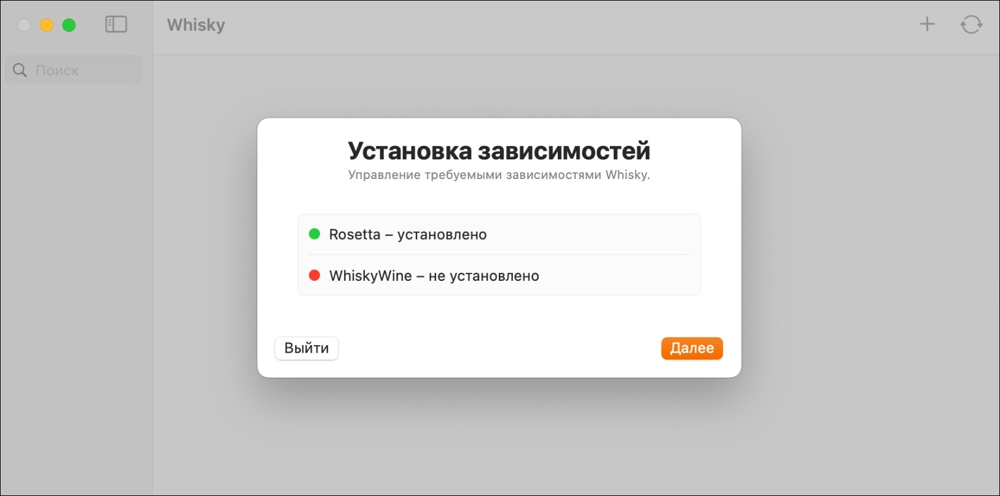

# Установка и запуск Whisky

Существует два основных способа установки: через менеджер пакетов **Homebrew** и вручную с официального сайта.

## Способ 1: Установка через Homebrew (рекомендуется)

**Homebrew** — это популярный менеджер пакетов для macOS. Если он ещё не установлен, откройте **Терминал** (Terminal) и выполните команду:

```bash
/bin/bash -c "$(curl -fsSL https://raw.githubusercontent.com/Homebrew/install/HEAD/install.sh)"
```

После завершения установки **Homebrew** введите следующую команду для установки **Whisky**:

```bash
brew install --cask whisky
```

**Homebrew** автоматически загрузит последнюю версию приложения и поместит его в папку «Программы».

---

## Способ 2: Ручная установка

1. Перейдите на [официальный сайт getwhisky.app](https://getwhisky.app/) или на [страницу релизов GitHub](https://github.com/Whisky-App/Whisky/releases).

2. Скачайте файл с расширением `.dmg` (например, `Whisky-x.x.x.dmg`).

3. Откройте скачанный образ и перетащите иконку **Whisky** в папку «Программы».

---

## Первый запуск

1. Запустите **Whisky** из папки «Программы». Система может предупредить, что приложение загружено из интернета — разрешите запуск (кнопка «Открыть»).

2. При первом запуске утилита автоматически проверит, есть ли все нужные компоненты, и установит недостающие. Нажмите «Далее».
   <dev markdown="span">
     {width="800" height="400" style="margin-top: 15px; margin-bottom: 5px;"}
   </dev>
3. Дождитесь окончания настройки. Если вы видите главное окно **Whisky** с предложением создать **бутылку**, значит, установка прошла успешно. Можно переходить к следующему шагу — созданию окружения.