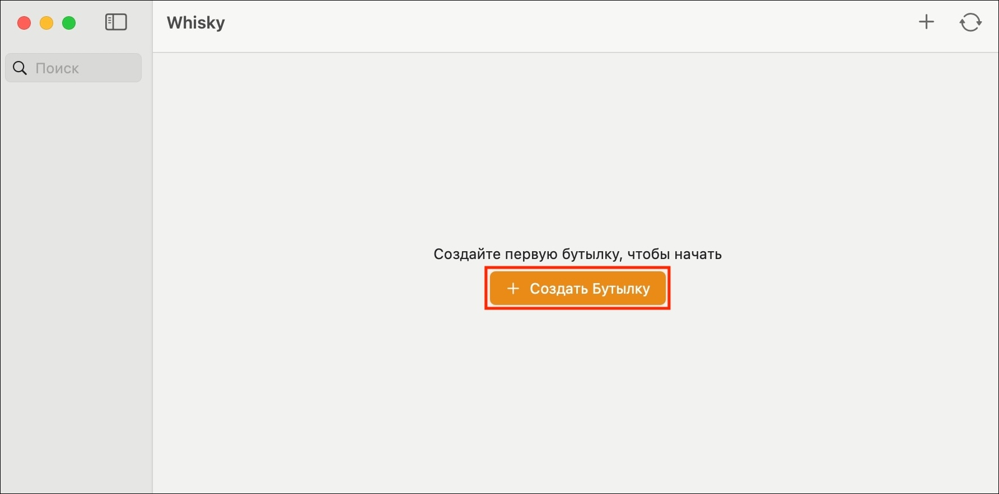
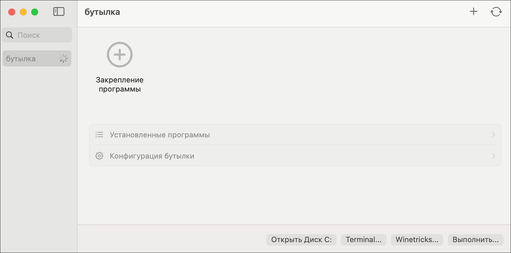
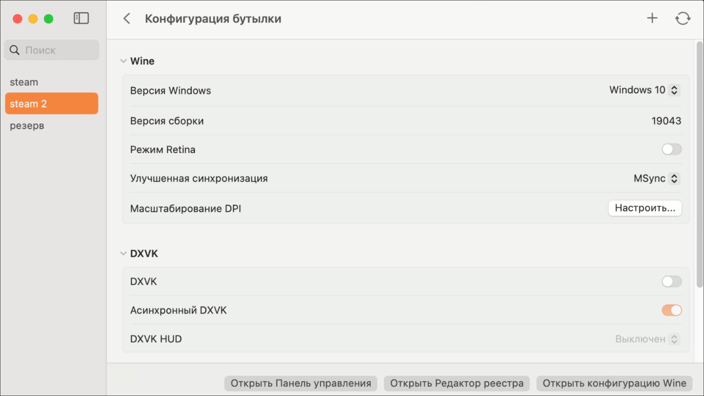

# Создание и настройка «бутылки»

Прежде чем устанавливать какую-либо программу, нужно создать для неё изолированное окружение — **бутылку**. Рекомендуется для каждого приложения или игры создавать отдельную **бутылку**.

## Пошаговая инструкция

В главном окне **Whisky** нажмите на кнопку «+ Создать бутылку» (или «+» в верхней части окна).

1. В появившемся окне заполните поля:
      - **Название бутылки** — например, `Steam`, `Heroes3` или `MyApp`.
      - **Версия Windows** — для современных приложений выберите **Windows 10/11**. Для игр более ранних версий может потребоваться Windows XP/7.
      - **Путь к бутылке** — можно оставить по умолчанию.

2. Нажмите «Создать».    
   Процесс занимает буквально пару минут. Когда всё будет готово, станут доступны кнопки взаимодействия с системой **бутылки**:
      - **Открыть Диск С:** — открыть в Finder папку, выделенную под системные файлы.
      - **Терминал** — запустить терминал для управления через командную строку.
      - **Winetricks** — открыть набор уже готовых команд для Whisky. Они нужны для быстрой установки программ (Steam, Firefox, офисные приложения и т.д.), бенчмарков, библиотек, шрифтов и настроек.
      - **Выполнить** — запустить файл `.exe` или `.msi` с компьютера.
   Новая **бутылка** появится в боковом меню слева. При выборе **бутылки** в правой части окна отобразятся её свойства и список установленных программ.

---

## Дополнительные настройки бутылки

Чтобы открыть настройки **бутылки**, выберите её и нажмите на «Конфигурация бутылки». Для каждой **бутылки** можно изменять параметры конфигурации:

   - **Версия Windows** — версия Windows **бутылки**.
   - **Конфигурация бутылки** — отображается текущая версия сборки Windows.
   - **Режим Retina** — даёт более высокую чёткость и качество интерфейса в играх, которые обрабатывают интерфейс и игру независимо друг от друга.
   - **Улучшенная синхронизация** — переключение между режимами синхронизации MSync и ESync, которые используются для повышения качества Windows-игр, запущенных через Wine.
   - **Масштабирование DPI** — масштабирование интерфейса (например, 100 или 125%). Параметр лучше изменять в соответствии с настройками монитора.
   - **DXVK** — слой перевода на базе Vulkan. Стоит включать, только если есть проблемы с производительностью в играх на DirectX 9, 10 и 11, либо если игра отказывается запускаться. Эта функция деактивирует D3DMetal — фреймворк, который помогает обеспечивать лучшую производительность в играх на DirectX 11 и 12. Параметр DXVK HUD выводит на экран дополнительный слой интерфейса с информацией о работе DXVK и производительности.
   - **Metal** — технология аппаратного ускорения игр на Mac. Параметр Metal HUD выводит на экран дополнительный слой интерфейса с информацией о работе Metal и производительности.
Также можно открыть редактор реестра и меню расширенных настроек Wine, но для базового использования программы описанных параметров будет достаточно.

---

## Удаление бутылки

Если **бутылка** больше не нужна, её можно удалить целиком. Это очистит все связанные с ней файлы и реестр. Для этого выберите **бутылку** и нажмите «Удалить» (в контекстном меню или в настройках).